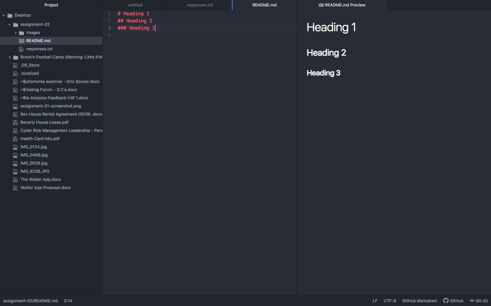

# Assignment 2
## Alexa Coyle
I have decided to take this class one because I believe web design and understanding the world of web is an important knowledge to have, especially in the world of business and specifically my major. I am a business management information systems major and this is a very valuable course for the skills I need to acquire for this major, and going forward in this field of work.

What I have learned:

1. The relationship between IP addresses and DNS

2. The internet sends binary information through bits

3. README.md files are directories to provide information about that repository

[Nike Website](https://www.nike.com)

[My Responses](./responses.txt)

