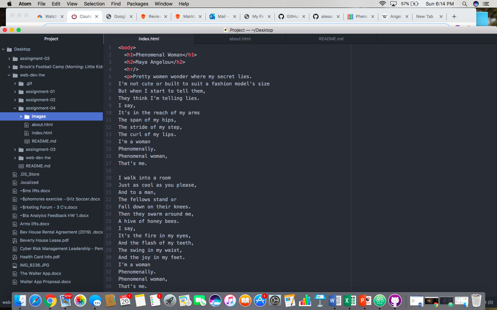

I looked at the Google website and it looked similar to how it does now with the main difference being graphically. The website now is more developed you could say, with an improved logo design that you can tell uses more advanced graphics.

This module was the most difficult. I learned how to connect GIT and Atom to have corresponding repos, but I am still unclear of where we perform what action. I also am misunderstood when we use HTML coding versus Markdown.

