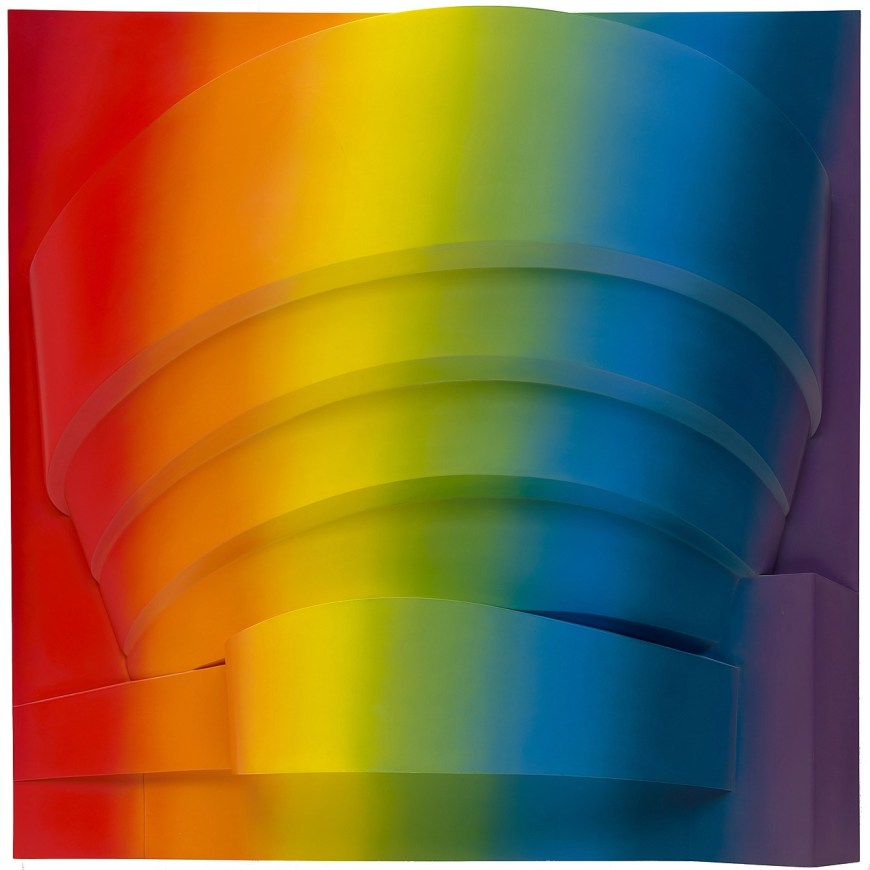

The difference between padding, margin, and borders is padding refers to the amount of space between the inner content of the element and the element itself, the margin is the space between the box and other elements, or the edge of the parent element, and borders are lines surrounding       .

 

 

My work cycle for this assignment included a lot of re-reading and going back and forth between the assignment and the text to fully understand how to do each aspect the assignment is asking for.

